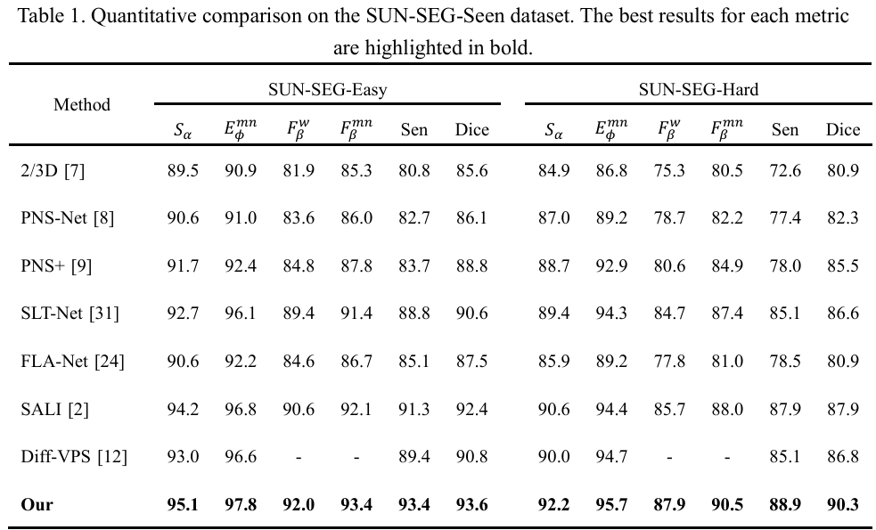
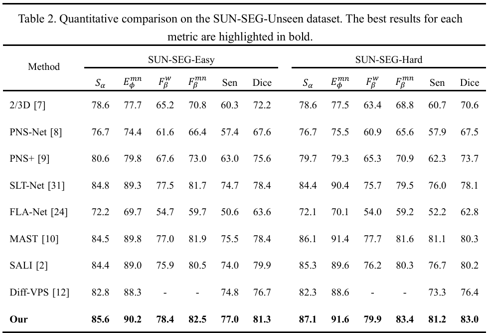

# Polyp-MoE: A Temporal-Structural Mixture-of-Experts Framework for Video Polyp Segmentation

## 🔍 Overview

Automatic video polyp segmentation plays a crucial role in the early screening and assisted diagnosis of colorectal cancer. However, endoscopic videos often exhibit motion blur, specular reflections, and structural occlusions, which severely hinder the modeling of cross-frame lesion continuity and structural completeness. To address these challenges, we propose Polyp-MoE, a novel medical video segmentation framework that integrates temporal modeling with a mixture-of-experts (MoE) mechanism. By jointly exploiting temporal consistency and structure-aware expert guidance, our framework enhances the model’s ability to perceive key lesion regions and recover complete structural information in low-quality frames. Specifically, we introduce a Temporal Consistency Guided Memory (TCGM) module that constructs dynamic spatiotemporal correspondences between the current and previous frames, effectively guiding degraded frames to focus on critical lesion areas and facilitating robust temporal modeling. In addition, we are the first to extend the MoE paradigm to medical video segmentation and propose a Structural Prior Mixture of Experts (SPMoE) module. This module comprises three learnable expert branches that respectively encode positional, scale, and boundary priors, and employs a lightweight prior-aware router to adaptively aggregate expert outputs for comprehensive structural completion. Extensive experiments on the SUN-SEG dataset demonstrate that our method consistently outperforms state-of-the-art approaches across all test scenarios, achieving notable Dice improvements of 2.4% and 2.7% on the challenging Seen-Hard and Unseen-Hard subsets, respectively, thereby validating its effectiveness in both temporal modeling and structural recovery.

<div  align="center">    

</div>

## Experimental Results

<div  align="center">    

</div>


<div  align="center">    

</div>


<div  align="center">    

</div>

## Requirements
- Pytorch 1.11.0
- Python 3.8
- CUDA 11.3

## Data Preparation
Please refer to [PNS+](https://github.com/GewelsJI/VPS/blob/main/docs/DATA_DESCRIPTION.md) to get access to the SUN-SEG dataset, and download it to path `./datasets`. The path structure should be as follows:
```none
  Polyp-MoE
  ├── datasets
  │   ├── SUN-SEG
  │   │   ├── TestEasyDataset
  │   │   │   ├── Seen
  │   │   │   ├── Unseen
  │   │   ├── TestHardDataset
  │   │   │   ├── Seen
  │   │   │   ├── Unseen
  │   │   ├── TrainDataset

  ```

### Pretrained
Please refer to [SALI](https://github.com/Scatteredrain/SALI) to get pvtv2, and download it to path `./pretrained`. 

### Evaluating
For fair comparison, we evaluate all methods through the toolbox `./eval` provided by [SALI](https://github.com/Scatteredrain/SALI)

## Acknowledgement

Our project references the codes in the following repos. Thanks for their works and sharing.
* [SALI](https://github.com/Scatteredrain/SALI)

## Contact

**First Author**: Juntong Ti, Kunming University of Science and Technology Kunming, Yunnan CHINA, email: hao1322346643@163.com

**Corresponding Author**: Lijun Liu, Ph.D., Kunming University of Science and Technology Kunming, Yunnan CHINA, email: cloneiq@kust.edu.cn

